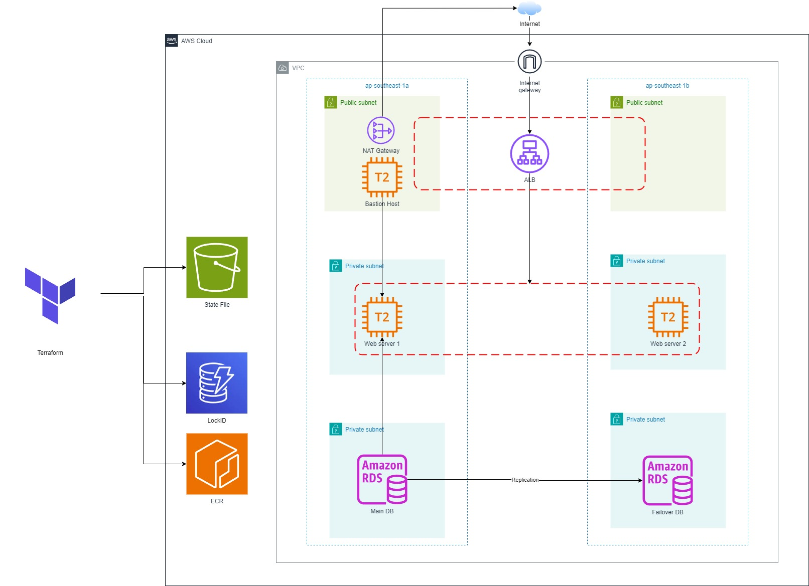

# Deploying Django Webapp to AWS

## Project Goals:
- Deploy AWS Infrastructure using Terraform modules. :white_check_mark:
- Dockerize Django app and push it to AWS Elastic Container Registry (ECR). :white_check_mark:
- Provision EC2 Instances and pull latest Docker image and run it. :white_check_mark: (Current doing it manually. Plan to do automaticaly with Ansible and GitHub Actions)
- Create workflows for GitHub Actions (CI/CD) Pipeline. (In Progress...)
- Update the database connection of the Django app from the local SQLite3 database to a MySQL RDS instance, and implement ElastiCache to reduce the load. (In Progress...)
- Provisoin EC2 Instances using Ansible. (In Progress...)
- Create task using lambda. (In Progress...)
- Managing secrets using GitHub Secrets. (In Progress...)

## Project Structure

## Technologies Used:
1. **Terraform (IaC)**: To deploy AWS Infrastructure resources using Terraform modules.
2. **AWS Resources**:
	- VPC (2 Public Subnets, 4 Private Subnets, Elastic IP, Nat Gateway, Internet Gateway).
	- 3 EC2 Instances (two for hosting the app and bastion host to ssh), and Application Load Balancer.
	- RDS.
	- S3 and Dynamodb: to store state file and lock it.
	- Security Groups.
3. **Docker**: To dockerize my Django application using a Dockerfile.

---More technologies will be added to the project in the future---
